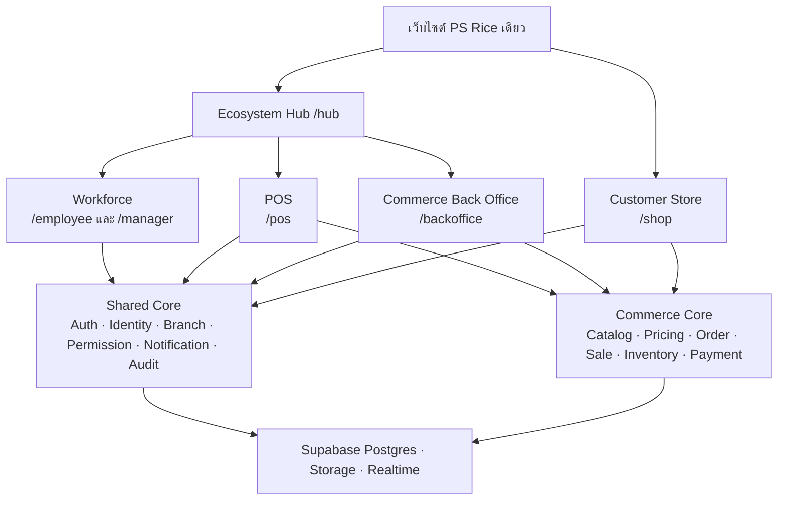
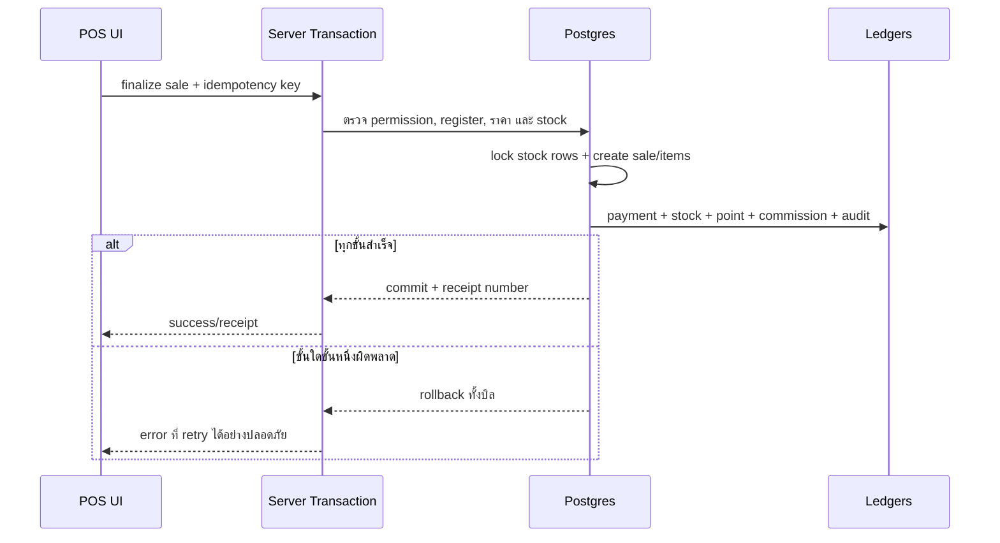

# แบบระบบ PS Rice Commerce & POS Ecosystem

สถานะเอกสาร: Proposed Architecture
วันที่: 8 สิงหาคม 2026
ขอบเขต: ออกแบบการเพิ่มระบบขายสินค้า, POS, สต๊อก, จัดซื้อ, สมาชิก และรายงาน เข้ากับเว็บไซต์ PS Rice เดิม โดยยังแยกพื้นที่ใช้งานของแต่ละกลุ่มอย่างชัดเจน

## 1. บทสรุปการออกแบบ

ข้อเสนอคือใช้ **เว็บไซต์เดียว, deployment เดียว, Supabase project เดียว และข้อมูลแกนกลางชุดเดียว** แต่แบ่งประสบการณ์ใช้งานออกเป็น 5 พื้นที่ (workspace) ตามหน้าที่:

1. **Ecosystem Hub (`/hub`)** — หน้าเลือกพื้นที่ทำงานหลังเข้าสู่ระบบ แสดงเฉพาะพื้นที่ที่ผู้ใช้มีสิทธิ์
2. **Workforce (`/employee`, `/manager`)** — ระบบพนักงานเดิม เช่น ลงเวลา งาน กะ คำขอ และเงินเดือน
3. **POS (`/pos`)** — หน้าขายสำหรับเครื่องคิดเงินหรือแท็บเล็ต เน้นเร็ว ปุ่มใหญ่ และทำงานตามสาขา/เครื่องขาย
4. **Commerce Back Office (`/backoffice`)** — สินค้า ราคา สต๊อก จัดซื้อ โอนสาขา การเงิน สมาชิก และรายงาน
5. **Customer Store (`/shop`)** — ร้านค้าออนไลน์สำหรับลูกค้า ตะกร้า ออเดอร์ สมาชิก คะแนน แนะนำเพื่อน และค่าคอมมิชชั่น

พื้นที่ทั้งหมดแชร์ข้อมูลหลัก เช่น `branches`, สินค้า, สต๊อก, ลูกค้า, ออเดอร์ และรายการขาย แต่แต่ละพื้นที่มี layout, เมนู, session context และสิทธิ์ของตัวเอง ผู้ใช้หนึ่งคนอาจเข้าถึงหลายพื้นที่ได้โดยไม่ต้องมีหลายบัญชี



## 2. สิ่งที่มีอยู่แล้วและผลต่อการออกแบบ

ระบบปัจจุบันเป็น Next.js 16 App Router + React 19 + Supabase และมีพื้นที่ `/employee` กับ `/manager` อยู่แล้ว ข้อมูลที่นำกลับมาใช้ร่วมได้ทันที ได้แก่:

- Supabase Auth และ auth session
- `users` สำหรับประวัติพนักงานเดิม
- `branches` สำหรับสาขา
- ระบบแจ้งเตือน
- ระบบพนักงาน ลงเวลา งาน กะ คำขอ และเงินเดือน
- private helper functions และ RLS ที่เริ่มแยกสิทธิ์ตามบทบาท/สาขาแล้ว

ข้อจำกัดที่ต้องแก้ก่อนเปิด Commerce:

- `users.role` มีเพียง `admin`, `manager`, `employee` จึงระบุสิทธิ์เฉพาะงาน เช่น ขาย, คืนสินค้า, ปรับสต๊อก หรืออนุมัติส่วนลดไม่ได้
- ผู้ใช้ผูกกับ `branch_id` เดียว แต่เจ้าของหรือพนักงานบางคนอาจทำงานหลายสาขา
- auth trigger ปัจจุบันสร้างทุกบัญชีใหม่เป็นพนักงาน `active` และสร้าง compensation profile อัตโนมัติ จึงใช้ flow เดียวกับลูกค้าสมัครสมาชิกไม่ได้
- `employee_shift_assignments` คือกะทำงานของ HR ส่วนการเปิด/ปิดลิ้นชัก POS เป็นคนละแนวคิด ห้ามใช้ตารางเดียวกัน
- `shift_sales_reports` เป็นยอดสรุปที่กรอกเอง ไม่ควรเป็นแหล่งข้อมูลจริงเมื่อมีรายการขายระดับบิลแล้ว

แนวทาง migration คือคงตารางและ URL เดิมไว้ก่อน เพิ่มโมดูลใหม่แบบไม่ทำลายของเดิม แล้วค่อยเปลี่ยนระบบสิทธิ์และรายงานให้ใช้ข้อมูลใหม่ทีละส่วน

## 3. หลักการสถาปัตยกรรม

### 3.1 One ecosystem, separated workspaces

- ใช้ชื่อโดเมนและแบรนด์เดียวกัน
- ใช้ auth session เดียวสำหรับคนที่เป็นทั้งพนักงานและลูกค้า
- แต่ละ workspace มี route layout และ navigation ของตัวเอง
- `/hub` ทำหน้าที่เป็น app switcher ไม่ใช่ dashboard ที่เอาทุกข้อมูลมาปนกัน
- ทุกคำสั่งที่มีผลทางการเงินหรือสต๊อกต้องผ่าน business transaction กลาง ไม่ให้แต่ละหน้าจอเขียนหลายตารางเอง

### 3.2 แยก Identity ออกจาก Profile

เสนอให้มี identity กลางหนึ่งรายการต่อ Supabase Auth user แล้วแยก profile ตามบริบท:

- `account_profiles` — ตัวตนกลางและชนิดบัญชี (`staff`, `customer`, `both`)
- `users` — คงไว้เป็น Staff Profile เพื่อรองรับระบบเดิม
- `customers` — Customer/CRM Profile อาจมีหรือไม่มี `auth_user_id` ก็ได้ เพราะลูกค้าหน้าร้านจำนวนมากไม่มีบัญชีออนไลน์
- `memberships` — สถานะสมาชิก ระดับสมาชิก วันที่เริ่ม/หมดอายุ และกติกาสะสมแต้ม

การมีอีเมลหรือเบอร์เดียวกันไม่ได้แปลว่าควร merge อัตโนมัติ ต้องยืนยันตัวตนก่อนเชื่อม customer กับ auth account

### 3.3 Ledger เป็นแหล่งข้อมูลจริง

- สต๊อกจริงมาจาก `stock_movements`; `stock_balances` เป็นยอดคงเหลือที่อัปเดตใน transaction เดียวกันเพื่ออ่านเร็ว
- การรับเงินมาจาก `payments`/`payment_allocations` ไม่ใช่ค่ารวมที่แก้ได้ในรายงาน
- คะแนนและคอมมิชชั่นใช้ ledger แยก (`point_ledger`, `commission_ledger`)
- รายการขายที่เสร็จแล้วห้ามลบหรือแก้ย้อนหลังแบบทับข้อมูล ต้อง void/return ด้วยรายการกลับรายการและ audit trail

### 3.4 Snapshot กติกา ณ เวลาขาย

ราคาทุน ราคาขาย ส่วนลด ภาษี promotion rule และ commission rule อาจเปลี่ยนภายหลัง ดังนั้น `sale_items` และ `order_items` ต้องเก็บ snapshot ที่ใช้จริง ณ เวลาทำรายการ เพื่อให้รายงานย้อนหลังไม่เปลี่ยนตาม master data

## 4. โครงสร้าง URL และหน้าจอ

### 4.1 Shared

| URL | หน้าที่ |
| --- | --- |
| `/` | ส่งผู้ใช้ไป `/shop` หรือ `/hub` ตามสถานะและสิทธิ์ |
| `/login` | เข้าระบบสำหรับพนักงาน/ผู้ดูแล |
| `/hub` | เลือก workspace, สาขาที่กำลังใช้งาน และแสดงงานด่วนข้ามระบบแบบสรุป |
| `/account` | โปรไฟล์ ความปลอดภัย อุปกรณ์ และ session ของบัญชีกลาง |

### 4.2 Workforce เดิม

คง `/employee/*` และ `/manager/*` ตามเดิม ลดความเสี่ยง regression และไม่บังคับย้ายผู้ใช้ทันที ใน Hub แสดงชื่อพื้นที่ว่า “งานพนักงาน” และ “บริหารทีม”

### 4.3 POS

| URL | หน้าที่ |
| --- | --- |
| `/pos` | หน้าขายหลัก: scan/search, cart, ลูกค้า, ราคา, ส่วนลด |
| `/pos/register/open` | เลือกสาขา เครื่องขาย และเงินสดตั้งต้น |
| `/pos/payment` | รับเงินสด, QR, โอน, สวัสดิการ, บัตร, เครดิต และ split payment |
| `/pos/receipts/[saleId]` | ใบเสร็จ พิมพ์ใหม่ หรือส่งให้ลูกค้า |
| `/pos/held` | พักบิล/เรียกบิลกลับ |
| `/pos/returns` | ค้นใบเสร็จและคืน/เปลี่ยนสินค้า |
| `/pos/orders` | ออเดอร์ออนไลน์ของสาขาที่ต้องยืนยันและจัดสินค้า |
| `/pos/register/close` | นับเงินจริง กระทบยอด ขาด/เกิน และส่งอนุมัติ |

POS ใช้ full-width touch layout และไม่ใช้ sidebar แบบ Back Office การเปลี่ยนสาขาหรือเครื่องขายระหว่างเปิด register session ต้องปิด session เดิมก่อน

### 4.4 Commerce Back Office

เมนูหลักแบ่งเป็นกลุ่ม ไม่แสดงทุกเมนูในระดับเดียว:

- ภาพรวม: Dashboard, งานรอจัดการ, แจ้งเตือน
- การขาย: รายการขาย, ออเดอร์ออนไลน์, คืนสินค้า, โปรโมชั่น
- สินค้า: สินค้า, หมวด, หน่วย, ราคา, barcode
- สต๊อก: ยอดคงเหลือ, movement, จอง, ตรวจนับ, ปรับปรุง, เสียหาย
- จัดซื้อ: ผู้ขาย, ใบขอซื้อ, ใบสั่งซื้อ, รับสินค้า, คืนผู้ขาย
- โอนสาขา: คำขอ, อนุมัติ, จัดส่ง, รับเข้า, ปัญหา
- ลูกค้า: ลูกค้า, สมาชิก, แต้ม, coupon, referral, commission, withdrawal
- การเงิน: รายรับอื่น, ค่าใช้จ่าย, ลูกหนี้/เครดิต, ปิดยอดรายวัน
- รายงาน: ยอดขาย, กำไร, สต๊อก, จัดซื้อ, ลูกค้า, commission
- ตั้งค่า: สาขา, เครื่อง POS, ช่องทางชำระ, permission, approval rule, audit

### 4.5 Customer Store

| URL | หน้าที่ |
| --- | --- |
| `/shop` | หน้าแรก สินค้าเด่น โปรโมชั่น และสาขาที่เลือก |
| `/shop/products` | ค้นหา/กรองสินค้าและสถานะพร้อมขาย |
| `/shop/products/[slug]` | รายละเอียด หน่วยขาย ราคา และ stock availability |
| `/shop/cart` | ตะกร้า โดยสินค้าในออเดอร์เดียวต้องอยู่ภายใต้ fulfillment rule ที่กำหนด |
| `/shop/checkout` | รับที่สาขา/จัดส่ง ที่อยู่ และชำระเงิน |
| `/shop/orders/[orderNo]` | สถานะออเดอร์และหลักฐาน |
| `/shop/account/*` | ประวัติออเดอร์ โปรไฟล์สมาชิก แต้ม coupon และเครดิต |
| `/shop/referrals` | link/code/QR แนะนำสมาชิก |
| `/shop/commission` | ledger, ยอดถอนได้ และคำขอถอน |

Customer Store ใช้ mobile-first bottom navigation ส่วนหน้ารายการสินค้าและ landing page render ฝั่ง server เพื่อ performance/SEO แล้วใช้ Client Components เฉพาะตะกร้า ตัวกรอง และ checkout ที่มี interaction

## 5. ระบบสิทธิ์

### 5.1 เปลี่ยนจาก role เดียวเป็น RBAC + branch scope

เพิ่มตาราง:

- `roles(id, code, name, workspace)`
- `permissions(id, code, description)`
- `role_permissions(role_id, permission_id)`
- `user_role_assignments(user_id, role_id, branch_id nullable, valid_from, valid_until)`
- `approval_limits(user_id/role_id, action_code, branch_id, max_amount, max_percent)`

`branch_id = null` หมายถึง scope ทุกสาขาได้เฉพาะ role ที่อนุญาต ไม่ใช่ fallback โดยอัตโนมัติ

ตัวอย่าง permission:

- `workforce.self`, `workforce.manage_branch`, `payroll.view`, `payroll.approve`
- `pos.sell`, `pos.discount_item`, `pos.discount_bill`, `pos.hold`, `pos.return`
- `pos.void`, `pos.open_register`, `pos.close_register`, `pos.review_variance`
- `catalog.read`, `catalog.manage`, `pricing.manage`, `promotion.manage`
- `inventory.read`, `inventory.count`, `inventory.adjust`, `inventory.transfer`
- `purchasing.request`, `purchasing.approve`, `purchasing.order`, `receiving.receive`
- `crm.read`, `crm.manage`, `commission.approve`, `commission.payout`
- `finance.read`, `expense.create`, `expense.approve`, `reports.executive`
- `system.manage_roles`, `system.manage_branches`, `audit.read`

### 5.2 Role preset เริ่มต้น

| Role preset | Workspace หลัก | Scope เริ่มต้น |
| --- | --- | --- |
| ลูกค้า/สมาชิก | Shop | ข้อมูลของตนเอง |
| พนักงานขาย | POS + Employee | สาขาที่ได้รับมอบหมาย |
| พนักงานคลัง | Back Office เฉพาะ stock/receiving/transfer | สาขาที่ได้รับมอบหมาย |
| ผู้จัดการสาขา | POS + Back Office + Manager | หนึ่งหรือหลายสาขาที่ได้รับมอบหมาย |
| ฝ่ายจัดซื้อ/บัญชี | Back Office เฉพาะโมดูล | ตาม permission ไม่อนุมานจากตำแหน่ง |
| เจ้าของ/ผู้ดูแลระบบ | Hub + ทุก workspace | ทุกสาขา พร้อม MFA |

`users.role` เดิมยังใช้กับหน้า Workforce ในช่วงเปลี่ยนผ่าน แต่หน้าที่เพิ่มใหม่ต้องตัดสินสิทธิ์จาก RBAC เท่านั้น และสุดท้ายจึงค่อยเปลี่ยน Workforce มาใช้ RBAC ด้วย

## 6. Data domains และตารางหลัก

### 6.1 Shared Core

| กลุ่ม | ตาราง |
| --- | --- |
| Identity | `account_profiles`, `users` (staff เดิม), `customers`, `customer_addresses` |
| Organization | `branches` (เดิม), `branch_operating_hours`, `pos_devices` |
| Authorization | `roles`, `permissions`, `role_permissions`, `user_role_assignments`, `approval_limits` |
| Platform | `notifications` (เดิมและขยาย category), `audit_logs`, `document_sequences`, `idempotency_keys` |

`document_sequences` ออกเลขเอกสารแบบ atomic แยกตามชนิดเอกสาร/สาขา/ปี เช่น `SAL-BKK-2026-000001` ห้ามใช้ `count + 1`

### 6.2 Catalog & Pricing

| ตาราง | หน้าที่ |
| --- | --- |
| `product_categories` | หมวดสินค้าแบบ tree |
| `products` | master สินค้า SKU, barcode หลัก, tax, status, reorder config |
| `product_images` | รูปสินค้าและลำดับ |
| `units` | kg, ถุง, ถัง, กระสอบ ฯลฯ |
| `product_units` | หน่วยที่สินค้านั้นขายได้และตัวคูณไป base unit |
| `product_barcodes` | หลาย barcode ต่อ product unit ได้ |
| `price_lists` | retail, member, wholesale, dealer หรือราคาเฉพาะสาขา |
| `product_prices` | ราคาแยกสินค้า หน่วย สาขา กลุ่มลูกค้า จำนวนขั้นต่ำ และช่วงเวลา |
| `promotions`, `promotion_rules`, `promotion_rewards` | promotion แบบมีเงื่อนไขและลำดับความสำคัญ |

ทุกสินค้าเก็บสต๊อกด้วย **base unit เดียว** เช่นกิโลกรัม การขาย 1 กระสอบแปลงเป็น 45 kg จาก `product_units.conversion_to_base` ส่วน “ถัง” ต้องกำหนด conversion ต่อสินค้า/ช่วงเวลาให้ชัด ห้ามฝังค่าไว้ในโค้ด

ลำดับราคาเริ่มต้นตามเอกสาร:

1. โปรโมชั่นที่เข้าเงื่อนไข
2. ราคาเฉพาะลูกค้า
3. ราคาสมาชิก
4. ราคาส่งตามจำนวน
5. ราคาปลีก

Price engine ต้องทำงานฝั่ง server/database และคืน `pricing_trace` เพื่อให้พนักงานเห็นว่าระบบเลือกราคาเพราะอะไร

### 6.3 Inventory

| ตาราง | หน้าที่ |
| --- | --- |
| `stock_balances` | on_hand, reserved, in_transit, damaged และ available แยก branch/product |
| `stock_movements` | immutable ledger รับเข้า ขาย คืน โอน ปรับ เสียหาย ใช้ภายใน |
| `stock_reservations` | จองให้ออเดอร์ออนไลน์พร้อมวันหมดอายุ |
| `stock_counts`, `stock_count_items` | รอบตรวจนับและผลต่าง |
| `stock_adjustments`, `stock_adjustment_items` | คำขอปรับยอดที่ผ่าน approval |

ข้อกำหนดสำคัญ:

- `available = on_hand - reserved - damaged` โดย in-transit แยกต่างหาก
- ห้าม client update `stock_balances` โดยตรง
- movement เก็บ `quantity_before`, `quantity_delta`, `quantity_after`, `reference_type/id`, actor และเวลา
- ห้าม stock ติดลบ เว้นแต่เปิด config รายสาขาและมี permission เฉพาะ
- ใช้ optimistic locking หรือ row lock ในขั้นตอน reserve/commit เพื่อลด overselling

### 6.4 Order, Sale & Payment

| ตาราง | หน้าที่ |
| --- | --- |
| `orders`, `order_items` | ออเดอร์จาก Shop/LINE/โทรศัพท์/agent และสถานะ fulfillment |
| `sales`, `sale_items` | เอกสารขายที่ finalized และ snapshot ราคา/ต้นทุน/ภาษี |
| `payments` | การรับ/คืนเงินแต่ละครั้งและสถานะ provider |
| `payment_allocations` | แบ่ง payment ไปยัง sale/order รองรับ split tender |
| `held_carts`, `held_cart_items` | บิลพักที่ยังไม่กระทบสต๊อก ยกเว้นกำหนด reservation |
| `returns`, `return_items`, `refunds` | คืน/เปลี่ยนสินค้าและ reverse ledger |
| `pos_register_sessions`, `pos_cash_movements`, `pos_register_closings` | เปิด/ปิดลิ้นชัก เงินสดตั้งต้น นำเข้า/ออก และขาด/เกิน |

แยกคำสำคัญให้ชัด:

- **Order** = ความต้องการซื้อ/งาน fulfillment อาจยังไม่รับเงินหรือยังไม่ออก sale
- **Sale** = เอกสารขายที่ final แล้วและใช้เป็นฐานรายงานรายได้
- **Payment** = เงินที่รับจริง อาจหนึ่งบิลหลายช่องทางหรือจ่ายหลายครั้ง
- **Employee shift** = เวลาทำงานของ HR
- **POS register session** = รอบความรับผิดชอบเงินสดของเครื่องขาย

### 6.5 Purchasing & Transfer

| กลุ่ม | ตารางหลัก |
| --- | --- |
| Supplier | `suppliers`, `supplier_products`, `supplier_cost_history` |
| Purchase | `purchase_requests/items`, `purchase_orders/items`, `goods_receipts/items`, `supplier_returns/items` |
| Transfer | `stock_transfers/items`, `transfer_shipments`, `transfer_receipts`, `transfer_issues` |

การรับของบางส่วนต้องทำได้ PO เดียวมี goods receipt หลายใบ ราคาทุนจริงและของเสียหายบันทึกต่อ receipt item การโอนตัดจาก available ของต้นทางไป in-transit ตอนส่ง และเพิ่ม on-hand ปลายทางเฉพาะจำนวนที่ยืนยันรับจริง

### 6.6 Customer, Loyalty & Commission

| ตาราง | หน้าที่ |
| --- | --- |
| `customer_groups`, `memberships` | กลุ่ม/ระดับสมาชิกและเงื่อนไข |
| `referral_codes`, `referral_relationships` | ผู้แนะนำและผู้ถูกแนะนำ พร้อม unique rule |
| `point_ledger` | earned, redeemed, expired, reversed |
| `coupons`, `coupon_redemptions` | สิทธิ์และการใช้ coupon |
| `commission_rules` | กติกาตามสินค้า น้ำหนัก เปอร์เซ็นต์ หรือ reward อื่น |
| `commission_ledger` | pending, available, reversed, paid ต่อ source sale item |
| `commission_withdrawals`, `commission_payouts` | ขอถอน ตรวจสอบ อนุมัติ และจ่ายจริง |

Commission เกิดเมื่อ order “paid/finalized” เท่านั้น ถ้ายกเลิกไม่เกิด และถ้าคืนสินค้าต้อง reverse ตามจำนวนที่คืน ต้องมี rule ป้องกัน self-referral, referral ซ้ำ, เบอร์/บัญชีธนาคารซ้ำ และกำหนด minimum withdrawal/payout schedule

### 6.7 Finance & Reporting

| ตาราง/ชั้นข้อมูล | หน้าที่ |
| --- | --- |
| `other_incomes` | รายรับที่ไม่ใช่ยอดขาย |
| `expenses`, `expense_attachments`, `expense_approvals` | ค่าใช้จ่ายและ approval ตามวงเงิน/หมวด |
| `customer_credit_accounts`, `customer_credit_ledger` | วงเงิน เครดิต และลูกหนี้ |
| `daily_branch_closings` | snapshot หลัง reconcile register sessions และรายการค่าใช้จ่าย |
| reporting views/materialized views | ยอดขาย กำไร สต๊อก ลูกค้า และจัดซื้อ โดยไม่ให้ dashboard query ledger ดิบทุกครั้ง |

ค่าใช้จ่ายกิจการไม่ควรใช้ `employee_requests` โดยตรง เพราะคำขอเบิก/ลา/เงินล่วงหน้าของ HR มี lifecycle คนละแบบ อาจเชื่อมกันด้วย `source_employee_request_id` เมื่อคำขอเบิกได้รับอนุมัติและกลายเป็นค่าใช้จ่ายจริง

## 7. Business transaction ที่ต้องเป็น atomic

คำสั่งต่อไปนี้ควรเป็น Postgres function ใน schema ที่ไม่ expose โดยตรง หรือ server-side service ที่เรียก transaction เดียว ห้ามให้ browser insert ทีละตาราง:

- `quote_cart` — คำนวณราคา promotion ภาษีและ stock availability โดยยังไม่ลงบัญชี
- `reserve_order_stock` — จองสินค้าตามสาขาและหมดอายุอัตโนมัติ
- `finalize_pos_sale` — สร้าง sale/items, payment/allocation, stock movement, point/commission ledger, income event และ audit
- `capture_order_payment` — ยืนยัน webhook แบบ idempotent และเปลี่ยนสถานะ order
- `fulfill_order` — ยืนยันของที่จัดจริงและสร้าง sale/stock movement ตาม policy
- `process_return` — ตรวจใบขายเดิม จำนวนคืน สิทธิ์คืนเงิน และสร้าง reversal ทุก ledger
- `ship_transfer` / `receive_transfer` — เปลี่ยน available ↔ in-transit ↔ on-hand
- `post_goods_receipt` — รับของ อัปเดตต้นทุน สต๊อก และสถานะ PO
- `close_pos_register` — สรุปตาม payment ledger เปรียบเทียบเงินนับจริงและสร้าง variance
- `approve_expense` / `approve_commission_withdrawal` — ตรวจ approval limit และบันทึกผู้อนุมัติ

ทุก mutation รับ `idempotency_key` จาก client และบังคับ unique ตาม action/actor เพื่อป้องกันการกดซ้ำหรือ retry จากอินเทอร์เน็ตไม่เสถียร



## 8. State machine สำคัญ

### 8.1 Online order

`draft → awaiting_payment → paid → confirmed → picking → ready_for_pickup/out_for_delivery → completed`

ทางแยก: `payment_failed`, `cancelled`, `partially_refunded`, `refunded`, `expired`

- reservation เริ่มเมื่อสร้าง order ตาม payment policy
- reservation ต้องมี TTL และ worker คืน stock เมื่อ order หมดอายุ
- payment webhook เป็นผู้ยืนยัน `paid` ไม่เชื่อ redirect จาก browser อย่างเดียว
- completed จึงทำ points/commission ให้ `available` หรือใช้ระยะรอคืนสินค้าเป็น `pending`

### 8.2 POS sale

`cart → held หรือ payment_pending → completed → partially_returned/returned`

Void ก่อนรับเงินจริงกับ refund หลังรับเงินจริงเป็นคนละ action และคนละ permission

### 8.3 Transfer

`draft → pending_approval → approved → picking → in_transit → partially_received/received`

ทางแยก: `rejected`, `issue`, `cancelled` โดยห้ามยกเลิกแบบทิ้ง in-transit balance

### 8.4 Purchase order

`draft → pending_approval → approved → ordered → partially_received → received → closed`

ทางแยก: `rejected`, `cancelled`; receipt ที่ post แล้วต้อง reverse ด้วย supplier return/receipt correction ไม่ลบ

## 9. การเชื่อมกับ Workforce เดิม

- sale/return เก็บ `performed_by_user_id` อ้างอิง `users.id` เพื่อดูผลงานพนักงานได้
- branch ใช้ `branches` เดิมเป็น master เดียว
- POS อาจตรวจว่าพนักงานลงเวลาแล้วก่อนเปิด register ได้ในภายหลัง แต่ให้เป็น policy configurable ไม่ hard-code ใน phase แรก
- `pos_register_sessions` แยกจาก `employee_shift_assignments` อย่างเด็ดขาด
- incentive ของพนักงานและ referral commission ของสมาชิกแยก ledger กัน แม้รายงานรวมค่าใช้จ่ายได้
- employee expense request ที่อนุมัติแล้วสามารถสร้าง operational expense ผ่าน explicit conversion ไม่ใช่แชร์ row เดียว
- notification service เดิมขยายให้รองรับ `order`, `stock`, `purchase`, `transfer`, `finance`, `commission`

## 10. Next.js application architecture

โครงสร้างแนะนำ:

```text
src/app/
├── (public)/shop/...
├── (auth)/login/...
├── (ecosystem)/hub/...
├── employee/...                 # เดิม
├── manager/...                  # เดิม
├── pos/...                      # POS layout
├── backoffice/...               # Back Office layout
└── api/
    ├── pos/sales/route.ts
    ├── orders/.../route.ts
    ├── payments/webhooks/.../route.ts
    ├── inventory/.../route.ts
    └── reports/.../route.ts

src/modules/
├── auth/
├── catalog/
├── pricing/
├── inventory/
├── orders/
├── sales/
├── payments/
├── purchasing/
├── loyalty/
└── reporting/
```

แนวทางการทำงาน:

- page/layout เป็น Server Component โดย default
- POS cart, barcode input, payment keypad และ live fulfillment queue เป็น Client Component เฉพาะส่วน
- logic ราคา/สต๊อก/สิทธิ์อยู่ใน module service ไม่อยู่ใน React component หรือ Zustand store
- Zustand ใช้เก็บ UI state/temporary cart ได้ แต่ไม่เป็นแหล่งข้อมูลจริงของ sale/stock/payment
- Route Handlers รับ webhook และ mutation ที่ต้องปกปิด secret; service role key อยู่ server เท่านั้น
- query รายงานที่หนักใช้ view/materialized view และกำหนด `security_invoker = true` เมื่อ view ต้องเคารพ RLS

## 11. Security, audit และการควบคุม

### 11.1 Database/API

- เปิด RLS ทุกตารางใน exposed schema
- migration ทุกตารางระบุ `GRANT` ให้ `anon`, `authenticated`, `service_role` อย่างชัดเจน
- ใช้ private security helper functions พร้อม `set search_path = ''`
- SECURITY DEFINER function ต้องไม่อยู่ใน exposed schema และ revoke execute จาก public โดย default
- service role key ห้ามลง browser bundle
- นโยบายลูกค้าใช้ `auth.uid() = customers.auth_user_id`; นโยบายพนักงานตรวจ permission + branch assignment
- เขียน pgTAP tests อย่างน้อยทุก permission boundary และ cross-branch isolation

### 11.2 Business controls

- ส่วนลดเกิน limit, void, refund, stock adjustment, expense และ commission payout ใช้ approval rule
- บิล finalized, movement, ledger และ audit log ห้าม hard delete
- เก็บ actor, timestamp, device, branch, before/after และ reason
- ปิด register แล้วพนักงานทั่วไปแก้ไม่ได้ การแก้ต้องเป็น adjustment พร้อมผู้อนุมัติ
- เจ้าของ/ผู้ดูแลระบบบังคับ MFA; งานเสี่ยงสูงอาจขอ PIN ซ้ำ
- ข้อมูลบัญชีธนาคารและเลขบัตรประชาชนจำกัด permission และหลีกเลี่ยงการนำไปอยู่ใน reporting view ทั่วไป

### 11.3 ประเด็น auth ที่ต้องแก้ก่อน Customer Store

ต้องเปลี่ยน `on_auth_user_created` flow ปัจจุบัน เพราะตอนนี้สร้างทุก auth user เป็นพนักงาน active และ compensation profile การออกแบบใหม่ต้อง:

1. สร้างเพียง identity ที่ไม่มีสิทธิ์ก่อน
2. สร้าง staff profile เฉพาะ flow สมัครงาน/เชิญพนักงานที่ผ่านการอนุมัติ
3. สร้าง customer profile เฉพาะ customer signup/claim flow
4. ไม่เชื่อ `account_type` จาก user metadata เพื่อให้สิทธิ์พนักงาน
5. migrate auth users เดิมไปเป็น `staff` และสร้าง RBAC assignment จาก role/branch เดิม

## 12. Reliability, offline และอุปกรณ์

### 12.1 POS connectivity

Phase แรกแนะนำ **online-required for finalization** แต่รองรับ local draft/held cart:

- scan และจัด cart ต่อได้ชั่วคราวเมื่อหลุดเน็ต
- finalize sale, ตัด stock และยืนยัน payment ต้องกลับมา online
- แสดงสถานะ connection ชัดเจนและไม่แกล้งแสดงว่าบิลสำเร็จก่อน server commit
- retry ด้วย idempotency key จึงไม่เกิดบิลซ้ำ

Full offline POS ที่ตัด stockหลายเครื่องพร้อมกันเป็น phase แยก เพราะต้องมี conflict resolution, local database, receipt numbering และ payment limitation

### 12.2 Hardware

- Barcode scanner แบบ keyboard wedge รองรับได้ก่อนโดย focus scan input ตลอดเวลา
- ใบเสร็จเริ่มจาก browser print template 80mm/58mm
- cash drawer, thermal printer protocol, scale และ customer display ทำผ่าน local print bridge/hardware agent ภายหลัง
- POS device มี `device_id`, branch binding, last_seen และ revocation

## 13. Reporting design

Dashboard ผู้บริหารประกอบด้วย:

- วันนี้/เดือนนี้: gross sales, net sales, gross profit, expense, net cash movement, bill count, online orders
- เทียบช่วงก่อน: ยอดขาย, กำไร, average bill, return rate
- สาขา/สินค้า: สาขายอดสูง, สินค้าขายดี, low stock, out of stock, slow-moving
- งานรอ: order ยืนยัน, PO/transfer/expense approval, commission payout, closing variance

รายงานต้อง filter ตามวัน/เวลา สาขา พนักงาน สินค้า หมวด ลูกค้า channel และ payment method การคำนวณกำไรใช้ cost snapshot ใน sale item หรือ cost allocation ที่กำหนดไว้ ไม่ใช้ราคาทุนปัจจุบัน

## 14. Roadmap แนะนำ

### Phase 0 — Foundation & Safety

ผลลัพธ์:

- แก้ auth trigger ให้แยก staff/customer
- เพิ่ม RBAC + branch assignments + permission tests
- เพิ่ม `/hub` และ workspace switcher
- วาง document sequence, idempotency, audit และฐาน migration/test
- ตกลง master data ของหน่วยข้าว, ภาษี, payment และเลขเอกสาร

เกณฑ์ผ่าน: customer signup ไม่มีทางได้ staff permission และ user จากสาขา A อ่าน/แก้ธุรกรรมสาขา B ไม่ได้ถ้าไม่มี assignment

### Phase 1 — Catalog, Pricing, POS & Inventory Ledger

ผลลัพธ์:

- สินค้า หมวด หน่วย barcode ราคาหลายระดับ
- POS sell/hold/split payment/receipt
- register open/close และ cash variance
- stock movement/balance และรายงานขายพื้นฐาน
- return/void พร้อม reversal

เกณฑ์ผ่าน: ขายหนึ่งบิลแล้ว sale, payment, stock และ closing reconcile กันเสมอ; การจำลอง failure กลาง transaction ไม่ทิ้งข้อมูลครึ่งบิล

### Phase 2 — Purchasing, Receiving, Transfer & Expense

ผลลัพธ์:

- supplier, PR, PO, partial receipt, supplier return
- transfer request/approval/shipping/partial receipt/issue
- stock count/adjustment approval
- other income, operational expense, approval rule, daily closing

เกณฑ์ผ่าน: on-hand + in-transit ของการโอนสามารถตามกลับถึงเอกสารและ actor ได้ทุกหน่วย

### Phase 3 — Customer Store & Omnichannel Order

ผลลัพธ์:

- catalog, cart, branch selection, pickup/delivery
- payment integration และ webhook idempotency
- reservation/expiration, fulfillment queue และ order tracking
- customer profile/order history

เกณฑ์ผ่าน: ไม่มี oversell ใน concurrent order test และ webhook ซ้ำไม่ทำให้รับเงิน/ตัด stock ซ้ำ

### Phase 4 — Membership, Loyalty, Referral & Commission

ผลลัพธ์:

- member tier, member pricing, point/coupon ledger
- referral relationship, commission rules/ledger
- withdrawal review/payout/reversal

เกณฑ์ผ่าน: คืนสินค้าบางส่วน reverse แต้มและ commission ตามสัดส่วน และทุกยอด wallet อธิบายย้อนกลับถึง sale item ได้

### Phase 5 — Executive Analytics & Automation

ผลลัพธ์:

- P&L, branch/product/customer analytics
- alerts, reorder recommendation, slow stock และ forecasting
- approval inbox รวม, scheduled reports และ advanced audit

เกณฑ์ผ่าน: dashboard ตัวเลขสุ่มตรวจตรงกับ ledger และปิดยอดของแต่ละสาขาในช่วงเดียวกัน

## 15. ข้อสรุปที่ควรตัดสินใจก่อนเริ่มพัฒนา

| เรื่อง | ค่าเริ่มต้นที่แนะนำ | ต้องยืนยัน |
| --- | --- | --- |
| ภาษี | เก็บ tax mode/rate ต่อสินค้าและ snapshot ต่อบิล | ร้านจด VAT หรือไม่และราคา include/exclude VAT |
| หน่วยข้าว | base unit = kg; กระสอบ/ถุง/ถังเป็น conversion ต่อสินค้า | 1 ถังของสินค้าแต่ละชนิดเท่ากับกี่ kg |
| ราคา | promotion → customer-specific → member → wholesale → retail | promotion ซ้อนกันได้หรือเลือกดีที่สุดเพียงหนึ่ง |
| Stock reservation | จองเมื่อสร้าง order และหมดอายุอัตโนมัติ | TTL และ policy กรณีโอน/QR manual |
| Payment | cash/QR/manual transfer ก่อน; gateway webhook ภายหลังได้ | ผู้ให้บริการ QR/card/ถุงเงินและค่าธรรมเนียม |
| Delivery | pickup + delivery zone/rate แบบง่ายก่อน | รถร้าน/ขนส่งภายนอก/คำนวณตามระยะทาง |
| Credit | เปิดเฉพาะลูกค้าที่อนุมัติวงเงิน | อายุหนี้, due date, ผู้อนุมัติ, credit limit |
| Return | ต้องอ้าง sale เดิมและ reason | ระยะเวลาคืนและสินค้า/หน่วยที่ห้ามคืน |
| Commission | pending จนพ้นช่วงคืนสินค้า | ระยะ hold, ขั้นต่ำถอน, รอบจ่าย, ภาษีหัก ณ ที่จ่าย |
| Offline POS | offline cart เท่านั้นใน MVP | ต้องขาย final แบบไม่มีอินเทอร์เน็ตหรือไม่ |
| Hardware | scanner + browser print ก่อน | รุ่น printer, drawer, scale และจำนวนเครื่องต่อสาขา |

## 16. ความเสี่ยงและวิธีลดความเสี่ยง

| ความเสี่ยง | วิธีรับมือ |
| --- | --- |
| ลูกค้ากลายเป็นพนักงานจาก auth trigger เดิม | ทำ Phase 0 ก่อนเปิด customer signup และทดสอบ privilege escalation |
| สต๊อกไม่ตรงจากหลายช่องทางขาย | ใช้ stock ledger + atomic transaction + reservation + reconciliation |
| บิลซ้ำจากกดซ้ำ/เน็ตหลุด | บังคับ idempotency key และ unique constraint |
| ราคาย้อนหลังเปลี่ยน | snapshot ราคา ต้นทุน ภาษี และ rule ลง item |
| ปนกะ HR กับกะ POS | แยก `employee_shift_assignments` และ `pos_register_sessions` |
| เมนูใหญ่จนใช้งานยาก | แยก workspace, permission-driven navigation และ role preset |
| รายงานช้าเมื่อข้อมูลโต | index ตาม access pattern และใช้ reporting views/materialized views |
| Permission ผิดข้ามสาขา | RLS + explicit grants + pgTAP cross-role/cross-branch tests |
| Scope บัญชีกว้างเกินระบบขาย | แยก operational finance จาก full accounting และกำหนด integration ภายหลัง |

## 17. สิ่งที่ไม่ควรรวมในรอบแรก

- บัญชีแยกประเภทเต็มรูปแบบ/งบการเงินตามมาตรฐานบัญชี
- Full offline POS หลายเครื่องพร้อม conflict resolution
- Forecast/AI recommendation ก่อนมีข้อมูลจริงเพียงพอ
- เชื่อมเครื่องชั่ง ลิ้นชัก และ printer ทุกยี่ห้อพร้อมกัน
- Marketplace หลายร้านหรือ multi-tenant SaaS
- Promotion engine ที่ซ้อนกฎได้ไม่จำกัด

การกันขอบเขตเหล่านี้ออกจาก MVP ช่วยให้แกน sale/payment/stock ถูกต้องก่อน ซึ่งเป็นส่วนที่แก้ย้อนหลังยากที่สุด

## 18. Definition of Done ระดับ Ecosystem

ระบบถือว่าเชื่อมเป็น ecosystem สำเร็จเมื่อ:

1. ผู้ใช้ login ครั้งเดียวและเห็นเฉพาะ workspace/สาขาที่มีสิทธิ์
2. ลูกค้าไม่ปรากฏเป็นพนักงาน และพนักงานที่ซื้อสินค้าเชื่อม customer profile ได้โดยไม่ปนข้อมูลเงินเดือน
3. POS และ Shop ใช้สินค้า ราคา และ stock availability จาก master เดียวกัน
4. การขาย/คืน/รับเข้า/โอนทุกครั้งสร้าง ledger ครบและย้อนกลับหาเอกสารได้
5. การปิด register และ daily branch closing reconcile กับ payment/expense จริง
6. รายงานยอดขาย กำไร สต๊อก แต้ม และ commission อธิบายย้อนกลับถึง transaction ต้นทางได้
7. RLS/permission tests ป้องกันการอ่านหรือแก้ข้อมูลข้ามสาขาและข้ามลูกค้า
8. การกดซ้ำ, webhook ซ้ำ และ retry ไม่สร้างผลทางการเงินหรือสต๊อกซ้ำ

## แหล่งข้อมูลที่ใช้ในการออกแบบ

- เอกสาร “โครงสร้างระบบขายสินค้าและ POS สำหรับร้านพี เอส ค้าข้าว” ที่ผู้ใช้ให้มา
- โครงสร้าง Next.js, route, auth store และ Supabase migrations ใน repository ปัจจุบัน
- Supabase documentation ปัจจุบันเรื่อง RLS, database functions, explicit grants และ Data API exposure
